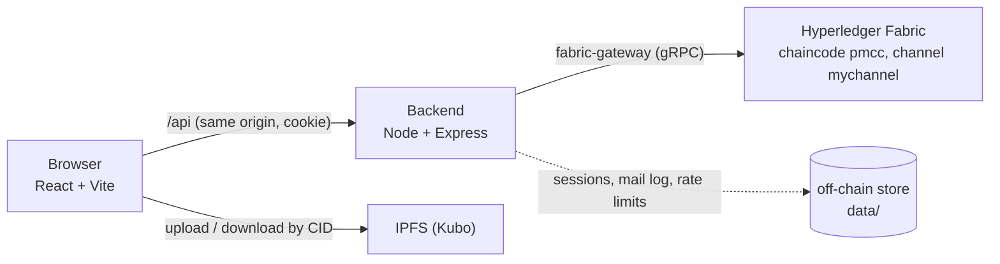

# ChainBoard

**A decentralized project management system on Hyperledger Fabric and IPFS.**
Accounts, projects, tasks and every change to them are blockchain transactions, so the history of who did what, and when, cannot be edited or erased. Attachments live on IPFS and are referenced by content ID.

Master's thesis project, Università di Genova (DIBRIS). Advisor: Prof. Marina Ribaudo. Reviewer: Prof. Gianna Reggio.

  

---

## What it does

- **Projects and roles, enforced by the chaincode.** Create a project, add people as owner, admin or contributor. The ledger itself decides who may do what: only owners and admins add members or archive tasks, only the owner archives a project, contributors work on tasks assigned to them or unassigned, and non-members can do nothing. The UI explains disabled buttons, but the chaincode is the authority.
- **Verifiable history.** "Verify audit trail" on any task or project checks every transaction against the peer, computes a SHA-256 digest chain over the whole history, and lets you download the report. `npm run verify-audit -- report.json` re-checks it offline: any edited, removed or re-ordered record is detected.
- **Boards read from the ledger.** A project's board is loaded from the chaincode (`getProjectTasks`), so it never depends on what one browser remembers.
- **Kanban board.** To Do, In Progress and Done columns with drag and drop. Overdue, done and archived tasks are visible at a glance, in words as well as colour.
- **Tasks.** Priorities, due dates, assignees, comments and file attachments (stored on IPFS).
- **Tamper-evident audit trail.** Every task, project and account has a history built from Fabric's `getHistoryForKey`. The app turns it into sentences such as "Status To Do → In Progress" or "Sam joined as admin".
- **Real accounts.** Sign up and sign in with email or username, Google sign-in, optional email confirmation, password change, and an on-chain security log per account.
- **Profile and settings.** A read-only profile (roles, teammates), light/dark/system theme, text size, reduced motion, and automatic refresh of the open screen.

## Why a blockchain

A project tracker is only as trustworthy as its history. In a normal database an administrator can quietly change a status, a due date or a comment. Here each change is an endorsed transaction on a permissioned ledger, so any reader can verify the full sequence of changes and nobody can rewrite it afterwards.

## Architecture



| Part | Folder | Role |
|---|---|---|
| Chaincode | `pm-chaincode/` | The business rules and the source of truth: users, projects, tasks, comments, attachment CIDs, index keys, history |
| Backend | `pm-backend/` | REST API, password hashing, login sessions, Google token check, rate limits. Talks to the ledger through one small adapter (`lib/ledger.js`) |
| Frontend | `pm-frontend/` | React client. Screen decisions live in plain, tested `*Logic.js` files |

### What lives on the ledger and what does not

| On the ledger | Off the ledger, on purpose |
|---|---|
| Accounts (name, username, phone, email, password **hash**, Google id) | Login sessions (HttpOnly cookie, hashed tokens): short-lived and high-churn |
| Projects, members and roles, tasks, comments, attachment CIDs | Email confirmation tokens, mail log, rate-limit counters |
| Uniqueness of username, phone and Google id (index keys written in the same transaction) | Attachment bytes (IPFS) |
| Every change to any of the above, as history | Browser preferences (theme, text size) |

Design rules the chaincode follows: it is **deterministic** (no hashing, randomness or wall-clock time inside; the transaction timestamp is used), and it uses **index keys** instead of queries because the default LevelDB world state has none.

## Quick start

### Prerequisites

- Linux or WSL2 with Docker, and the Hyperledger Fabric binaries and `test-network` from [fabric-samples](https://github.com/hyperledger/fabric-samples)
- **Node.js 20.9 or newer** (required by `@hyperledger/fabric-gateway`)
- An IPFS node ([Kubo](https://docs.ipfs.tech/install/command-line/)) for attachments

This repository is meant to sit **inside** your `fabric-samples` folder (the backend reads the test-network certificates from `~/fabric-samples/test-network`).

```bash
cd ~/fabric-samples
git clone https://github.com/anitatehrani/ChainBoard.git dpm-project
```

### 1. Start the network and deploy the chaincode

```bash
cd ~/fabric-samples/test-network
./network.sh down
./network.sh up createChannel -c mychannel
./network.sh deployCC -ccn pmcc -ccp ../dpm-project/pm-chaincode -ccl javascript -ccv 1.0 -ccs 1
```

Redeploying after a chaincode change: increase both `-ccv` and `-ccs` (for example `-ccv 1.1 -ccs 2`) and run the same `deployCC` command again. The permission change altered the arguments of the project and task functions, so deploy the chaincode and the backend together. If you are unsure, start from a fresh network (`./network.sh down`), which is the simplest on a development machine.

### 2. Start IPFS (for attachments)

```bash
ipfs daemon
# once, so the browser may upload to the local node:
ipfs config --json API.HTTPHeaders.Access-Control-Allow-Origin '["http://localhost:5173"]'
ipfs config --json API.HTTPHeaders.Access-Control-Allow-Methods '["PUT","POST"]'
```

### 3. Start the backend

```bash
cd ~/fabric-samples/dpm-project/pm-backend
npm install
cp .env.example .env      # every value is optional for local use
npm run dev               # restarts on every change; "node app.js" also works
```

### 4. Start the frontend

```bash
cd ~/fabric-samples/dpm-project/pm-frontend
npm install
npm run dev               # http://localhost:5173 (proxies /api to :3000)
```

### 5. Load demo data (optional)

```bash
cd ~/fabric-samples/dpm-project/pm-backend
npm run seed
```

The seed script uses the normal API, so everything it creates is a real transaction. It makes five accounts and four projects with tasks in every state (overdue, due today, done, archived, reopened, with comments and files). Sign in as:

| | |
|---|---|
| Username | `anita.tehrani` (or `anita.tehrani@example.com`) |
| Password | `Blockchain&IPFS-Genova-2026` |

The other demo users are `marco.rossi`, `giulia.bianchi`, `sara.conti` and `luca.ferrari`, with the same password. These are demo credentials for a local test network only. The ledger cannot be edited, so to start over, wipe the network (`./network.sh down`) and redeploy.

Boards load their tasks from the ledger, so the seeded tasks appear as soon as you open a project.

## Tests

```bash
cd pm-backend  && npm install && npm test
cd pm-frontend && npm test
```

The backend tests run the **real chaincode** (`pm-chaincode/index.js`) on an in-memory mock stub behind the real Express app, so no Fabric network is needed. They cover sign-up and sign-in, sessions, CSRF, rate limiting, password rules (including a client/server parity check), Google sign-in, email confirmation, ownership from the session, role-based permissions, the audit digest chain, and the task and project rules. The frontend tests cover the decision logic of every screen with Node's built-in runner, no browser needed.

## Evaluation

```bash
cd pm-backend && npm run benchmark     # write/read latency, throughput by concurrency, MVCC contention
npm run verify-audit -- audit-task-demo-t01.json    # offline check of a downloaded audit report
```

Method, how to report results, and the threat model (what the blockchain does and does not protect against) are in [`pm-backend/docs/EVALUATION.md`](pm-backend/docs/EVALUATION.md).

## Security summary

Passwords are hashed with scrypt (salted, off-chain) and only the hash is stored. Sessions use an HttpOnly, SameSite=Lax cookie holding a random token; only its SHA-256 is stored. State-changing requests are checked against Origin/Host (CSRF), there is no CORS, and responses carry security headers and `Cache-Control: no-store`. Sign-in, sign-up, username lookups, Google endpoints and outgoing mail are rate limited. Google sign-in never takes over an existing password account. Owner, author and similar identities always come from the verified session, never from the request body. Details and reasoning: [`pm-backend/AUTH.md`](pm-backend/AUTH.md).

## Project layout

```
pm-chaincode/    Fabric chaincode (JavaScript, fabric-shim)
pm-backend/      Express API, lib/ (passwords, sessions, ledger adapter, mailer…), test/, scripts/seed-demo.js, AUTH.md
pm-frontend/     React + Vite client, src/*Logic.js (+ tests), src/components, src/design/tokens.css, docs/DESIGN.md
```

More documentation: [`pm-backend/AUTH.md`](pm-backend/AUTH.md) (authentication design), [`pm-backend/docs/EVALUATION.md`](pm-backend/docs/EVALUATION.md) (benchmark method and threat model) and [`pm-frontend/docs/DESIGN.md`](pm-frontend/docs/DESIGN.md) (design decisions per screen).

## Troubleshooting

| Symptom | Likely cause and fix |
|---|---|
| "The backend is not responding" in the browser | Backend is not running: `npm run dev` in `pm-backend` and read its terminal |
| "Cross-site request blocked" | The dev proxy must keep the original Host. `pm-frontend/vite.config.js` sets `changeOrigin: false`; restart `npm run dev` |
| Sign-up fails with "Expected: email, name, passwordHash…" | An older chaincode is still deployed. Redeploy on a fresh network |
| "Expected: … actorId" errors | The chaincode is older than the backend (or the other way round). Redeploy the chaincode from this repository |
| "Permission denied: …" | Working as intended: the chaincode refused an action the person's role does not allow |
| Attachments fail to upload | IPFS daemon not running, or the CORS settings from step 2 are missing |
| Engine warning about Node 18 | Upgrade to Node 20 or newer |

## Author

Anita Tehrani, Università di Genova, DIBRIS.
